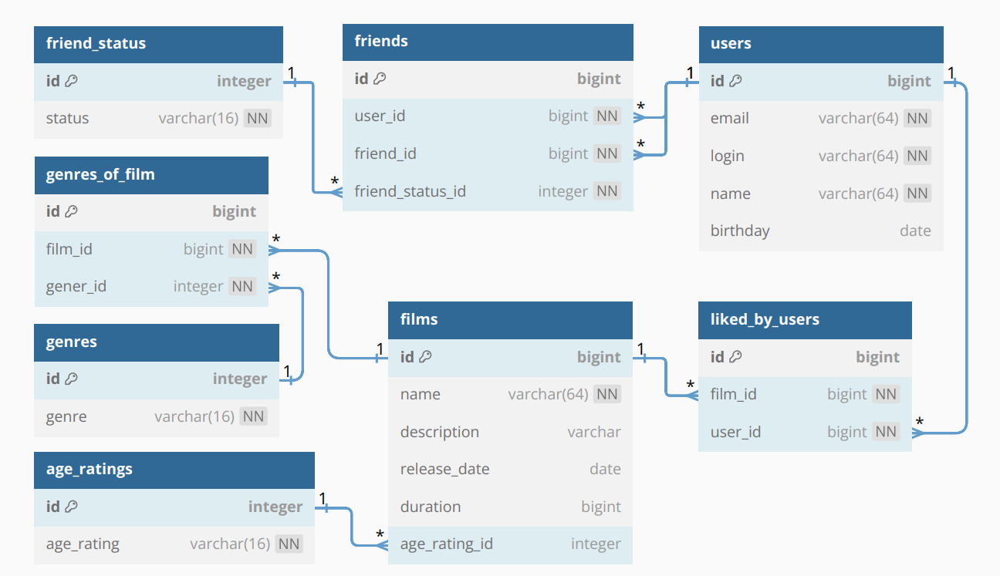

# Java Filmorate
### Описание
Данный проект создан в учебных целях (для изучения разработки backend приложений).
Имеет функционал работы с такими объектами, как фильм и пользователь.
Фильмы обладают свойствами жанра и возрастного рейтинга. Возможен поиск фильмов с различной фильтрацией,
а также по популярности. Популярность фильмов определяется по количеству лайков. Каждый пользователь имеет возможность 
добавлять и удалять лайки и друзей, искать общих друзей.

Групповой проект с более полной функциональностью представлен здесь: [Java Filmorate (extended)](https://github.com/bxiit/java-filmorate)
### Технологии
* Java
* Spring Boot
* JdbcTemplate
* SQL
* Maven

### Template repository for Filmorate project.

